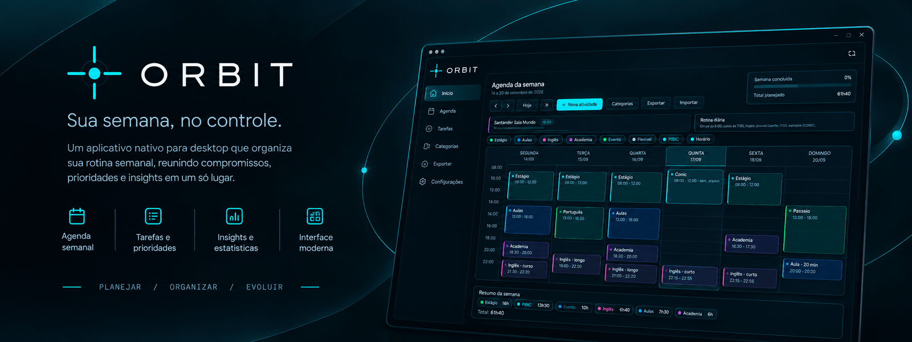

# ORBIT

**Planner pessoal de desktop, 100% local.** Três módulos independentes sobre a mesma casca:

| Módulo | Eixo | O que responde |
| --- | --- | --- |
| **Agenda** | horizontal — o tempo passando | O que acontece na terça? Quantas horas a semana tem? |
| **Treinos** | vertical — progressão | Estou evoluindo na carga? Que grupo muscular ficou de fora? |
| **Projetos** | vertical — profundidade | Quanto tempo investi nessa pesquisa? Qual é o próximo prazo? |

A agenda é o eixo do tempo. Treinos e Projetos atravessam semanas com vida própria e **não interferem na agenda** — cada um tem o seu domínio e o seu armazenamento, e nenhum lê os dados do outro.

> Veja a sua semana como um sistema.

---

## Instalação

### Para usar

Baixe o instalador mais recente em [Releases](https://github.com/JoaoManoel01/Planner-Semanal/releases) e execute.

O aplicativo não é assinado digitalmente, então o Windows exibe o aviso do SmartScreen na primeira execução — **Mais informações → Executar assim mesmo**. Depois de instalado, ele se atualiza sozinho quando uma nova versão é publicada.

### Para desenvolver

```bash
git clone https://github.com/JoaoManoel01/Planner-Semanal.git
cd Planner-Semanal
npm install
npm run electron:dev
```

---

## Funcionalidades

### Agenda

- Grade semanal de **segunda a domingo**, trilho de 08:00 às 24:00 com resolução de 10 minutos.
- Navegação entre semanas (**anterior / próxima / Hoje**) com estado visual de semana corrente, passada ou futura.
- Linha de **"agora"** marcando o instante atual dentro da grade.
- **Arrastar para reagendar**, com snap (30 min padrão, 10 min para reuniões) e detecção de sobreposição.
- Atividades com título, categoria, dia(s), início/fim, descrição e marcação de **flexível** — criáveis em vários dias de uma vez.
- **Categorias** com identidade de cor, filtro visual na grade e proteção contra excluir categoria em uso.
- **Eventos temporais** (evento, prazo, marco, lembrete) e **contexto fixo** que permanece visível em todas as semanas.
- **Resumo quantitativo**: total de horas, distribuição por categoria, carga por dia e categoria predominante.
- **Insights por regras**, sem fabricar conteúdo: sobreposições, prazos próximos, dia atípico, padrões de sequência, maiores janelas livres, o que resta hoje.
- **Repetir outra semana** na semana atual, copiando a estrutura de atividades.
- Densidade da grade configurável: compacta, normal ou ampla.

### Treinos

- **Plano semanal**: escolha os dias e adicione exercícios com a carga de 100%. As séries saem derivadas — aquecimento + 60% + 80% + 100%.
- **Sessão do dia**: registre o peso executado e as repetições; a linha se marca como registrada e o 1RM estimado aparece na hora.
- **Mapa corporal** anatômico, frente e costas, que acende cada grupo conforme o volume do dia ou da semana.
- **Octógono de desempenho** e distribuição em barras por grupo muscular.
- **Progressão por exercício** com curva de carga e 1RM ao longo das semanas.
- **Volume por semana** consolidado na linha do tempo.
- **Pesagem em jejum** com curva de peso e média móvel de 7 dias.

### Projetos

- **Índice** com estado do projeto, tempo investido, ritmo das últimas semanas e o prazo mais próximo.
- **Workspace por projeto** — cada atividade é um espaço próprio, isolado da semana.
- **Marcos** com data (entregas, submissões, bancas) e aviso de atraso.
- **Registro de trabalho**: data, tempo e o que avançou.
- **Curva de investimento** com barras de ritmo semanal sobre a linha do acumulado. As duas leituras juntas de propósito: sozinho, o acumulado nunca acusa abandono, porque só sobe.

### Aparência

- Temas **escuro** e **claro**, com acentos **Cyan**, **Petról**, **Gelo** e **Púrpura** — este último redefine as superfícies inteiras, não só a cor de destaque.
- Sistema de ícones SVG inline (outline, 24×24, `stroke 1.5`). Nenhum emoji na interface.
- Avisos discretos com **desfazer** e confirmações próprias, no lugar de `alert`/`confirm`.
- Splash screen com ativador por arrasto e atalhos de teclado com tela de ajuda.

---

## Seus dados

Tudo fica **no seu computador**, em `localStorage`, separado por módulo (`orbit:agenda:v4`, `orbit:treinos:v1`, `orbit:projetos:v1`). O aplicativo não faz nenhuma chamada de rede: não há servidor, conta, sincronização ou telemetria.

Isso tem duas consequências práticas:

- **Backup é com você.** Exporte pelo menu de ferramentas — sai um JSON com os três módulos (`versaoBackup: 3`). A importação aceita backups nas versões 2 e 3, e o que o arquivo não trouxer permanece intacto.
- **O backup contém tudo.** Agenda, treinos e projetos em texto puro. Trate o arquivo como documento pessoal.

Instalar em outra máquina começa do zero: os dados não viajam junto com o aplicativo.

---

## Stack

- **React 18** + **Vite 6**
- **CSS com design tokens** centralizados em `src/styles/tokens.css` — nenhum componente escreve hexadecimal
- **Electron** + **electron-builder** (instalador NSIS para Windows, com atualização automática via GitHub Releases)
- JavaScript (JSX), sem TypeScript neste momento

## Scripts

```bash
npm run dev            # navegador (Vite)
npm run build          # build web em dist/
npm run preview        # serve o build de produção
npm run electron:dev   # aplicativo Electron em desenvolvimento
npm run electron:build # empacota em %LOCALAPPDATA%/orbit-release (fora do OneDrive)
npm run icon           # regenera os ícones
```

> O build do Electron sai fora da pasta do projeto de propósito: quando a saída fica dentro de uma pasta sincronizada pelo OneDrive, o rename de `win-unpacked` falha com `EPERM` e o empacotamento morre no meio.

## Publicar uma versão

```bash
npm version 1.2.0 --no-git-tag-version
git commit -am "chore: versão 1.2.0"
git tag v1.2.0
git push origin main --tags
```

A tag dispara [`.github/workflows/release.yml`](.github/workflows/release.yml), que compila e publica no GitHub Releases. Os aplicativos já instalados baixam a atualização sozinhos na abertura seguinte — desde que o número da versão tenha subido, porque é ele que o updater compara.

---

## Estrutura

```text
.
├── docs/                # imagens do repositório
├── electron/            # camada desktop (janela, updater)
├── legacy/              # versão anterior em JS puro (referência)
├── scripts/             # utilitários (geração de ícones)
├── build/               # ícones do aplicativo
└── src/
    ├── App.jsx          # composição das telas e ações
    ├── main.jsx         # entrypoint React
    ├── index.css        # entrada dos estilos
    ├── components/
    │   ├── agenda/      # módulo Agenda: grade, cards, resumo e diálogos da semana
    │   ├── treino/      # módulo Treinos: plano, sessão, mapa corporal e progressão
    │   ├── projeto/     # módulo Projetos: índice, workspace, marcos e curva
    │   ├── layout/      # casca comum a todos os módulos
    │   ├── modals/      # diálogos de aplicação (preferências, atalhos)
    │   ├── splash/      # tela de entrada
    │   └── ui/          # primitivas: ícones, modal, gráfico, segmentado, avisos
    ├── domain/          # regras puras (tempo, semana, insights, treinos, projetos)
    ├── store/           # estado, ações e persistência — um store por módulo
    ├── hooks/           # relógio, atalhos e assinatura dos stores
    └── styles/          # tokens e estilos por área
```

A direção é sempre `UI → store/ações → domain → persistência`. Componentes só renderizam dados normalizados; as regras vivem em `domain/` como funções puras, sem tocar em armazenamento; o `localStorage` fica isolado em `store/`.

Cada módulo é uma pasta em `components/` com o seu domínio e o seu store. Os três não se conhecem. O que eles compartilham vive em `ui/` e `layout/` — e só chega lá quando um segundo módulo passa a precisar.

## Design

A identidade visual e as regras de implementação estão em [`brandkit.md`](brandkit.md): tokens, escala tipográfica, geometria dos ícones, espaçamento, movimento e o critério do que é considerado visualmente pronto.

Resumo do DNA: **escuro, petról, cyan, preciso**. Função acima de decoração, informação acima de ornamento, animação rápida e discreta.
